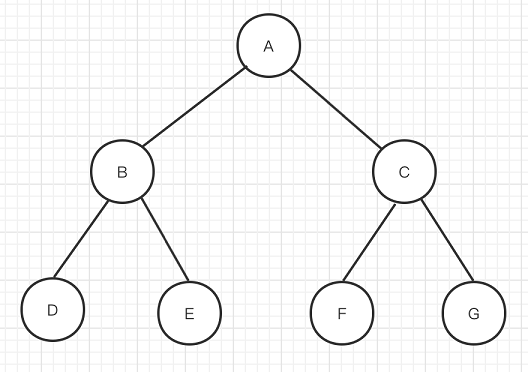
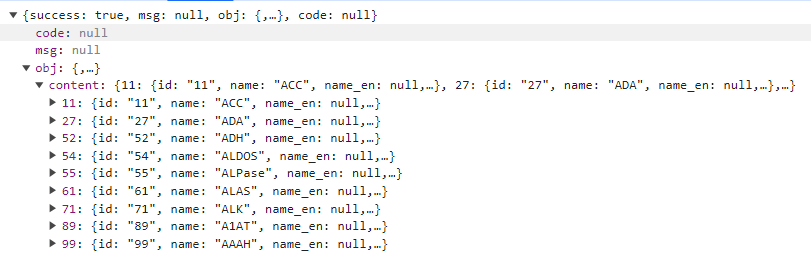
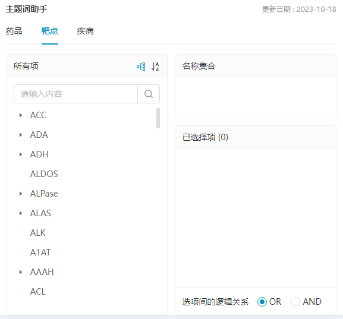
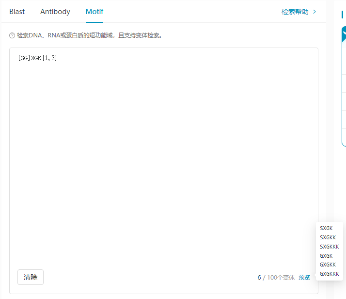
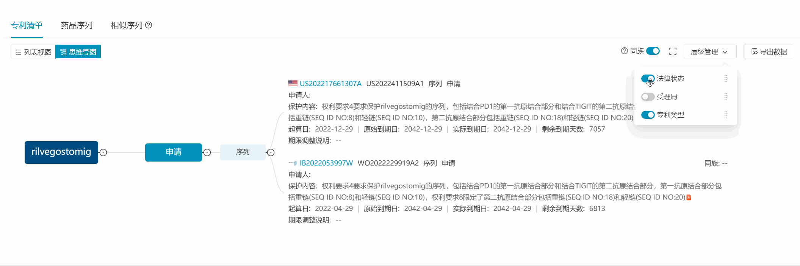
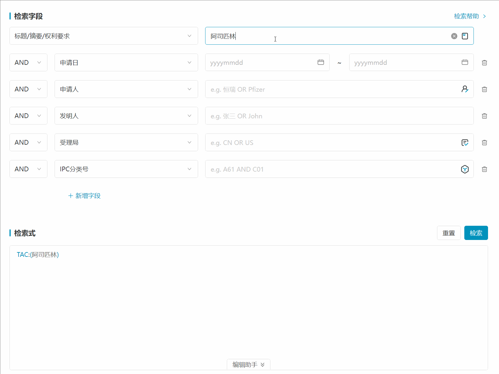

# 前端项目数据处理

前端相对于后端来说，很少会接触复杂的数据处理，或者说是算法，大部分情况下是后端同学帮我们处理好了返回给我们，我们进行渲染，更多情况下我们会做些数据的转换来适配我们的组件数据格式要求，比如 Echarts 或者 Antd 组件的格式，我们常用数据以数组居多，常用的方法：forEach,map,filter,find,findIndex,some,every,sort,slice,splice,reduce...

### 前端日常可能会接触到的一些数据处理和算法

### 递归

深拷贝

```
JSON.stringify() / JSON.parse()
```

```
function deepClone(obj) {
  if (typeof obj !== "object" || obj == null) {
    return obj;
  }
  const result = obj instanceof Array ? [] : {};
  for (let key in obj) {
    if (obj.hasOwnProperty(key)) {
      result[key] = deepClone(obj[key]);
    }
  }
  return result;
}
```

组件递归（菜单 AntdVue3.x）

```
// 定义递归子组件
const SubMenu = {
  name: 'SubMenu',
  props: {
    menuInfo: {
      type: Object,
      default: () => ({}),
    },
  },
  template: `
    <a-sub-menu :key="menuInfo.key">
      <template #title>{{ menuInfo.title }}</template>
      <template v-for="item in menuInfo.children" :key="item.key">
        <template v-if="!item.children">
          <a-menu-item :key="item.key">
            {{ item.title }}
          </a-menu-item>
        </template>
        <template v-else>
          <sub-menu :menu-info="item" :key="item.key" />
        </template>
      </template>
    </a-sub-menu>
  `,
}

// 使用子组件
<a-menu>
  <template v-for="item in list" :key="item.key">
    <template v-if="!item.children">
      <a-menu-item :key="item.key">
        {{ item.title }}
      </a-menu-item>
    </template>
    <template v-else>
      <sub-menu :key="item.key" :menu-info="item" />
    </template>
  </template>
</a-menu>
```

### 树



先序遍历: A->B->D->E->C->F->G

中序遍历: D->B->E->A->F->C->G

后续遍历: D->E->B->F->G->C->A

- DFS

```
function traversal_dfs(tree, cb) {
  tree.forEach((item) => {
    cb(item); // 先序遍历
    item.children && traversal_dfs(item.children, cb);
    // cb(item); // 后序遍历
  });
}

```

- BFS

```
function traversal_bfs(tree, cb) {
  let node;
  const list = [...tree];
  while ((node = list.shift())) {
    cb(node);
    node.children && list.push(...node.children);
  }
}

```

### 项目示例 1：列表转树




```
function listToTree(list) {
  const nodeMap = list.reduce((map, node) => {
    map[node.id] = node;
    node.children = [];
    return map;
  }, {});
  return list.filter((node) => {
    nodeMap[node.parentId] && nodeMap[node.parentId].children.push(node);
    return !node.parentId;
  });
}
```

### 项目示例 2：数组的排列组合


https://nextpat.pharmcube.com/nextbioseq/search

简化例子： [[A,B],[X],[1,2,3]]

希望得到的结果 [AX1,AX2,AX3,BX1,BX2,BX3]

- 思路1 [AX,BX][1,2,3]
- 思路2 [A][X][1] [A][X][2] [A][X][3]

- 思路1 reduce

```
function permutate(arr) {
  if (!arr?.length) {
    return [];
  }
  return arr.reduce((acc, cur) => {
    if (acc.length === 0) {
      return cur;
    }
    if (cur.length === 0) {
      return acc;
    }
    const result = [];
    acc.forEach((item) => {
      cur.forEach((citem) => {
        result.push(`${item}-${citem}`);
      });
    });
    return result;
  }, []);
}
```

- 思路2 backtrack

```
function permutate(arr) {
  if (!arr?.length) {
    return [];
  }
  const result = [];
  const backtrack = (index, currentList) => {
    if (index === arr.length) {
      result.push([...currentList]);
    } else {
      arr[index].forEach((item) => {
        currentList.push(item);
        backtrack(index + 1, currentList);
        currentList.pop();
      });
    }
  };
  backtrack(0, []);
  return result;
}
```

### 项目示例 3：多级嵌套对象分组



简化例子

```
数据源：
[
  {
    名字:"小明"，
    性别:"男"，
    部门："前端"，
    BU:"新药"
  }，
  {
    名字:"小红"，
    性别:"女"，
    部门："后端"，
    BU:"新药"
  }
]
分组规则：[性别，部门，BU]

```

```
function genGroupTreeFromList(list, groupFields) {
  const groupFieldsLen = groupFields.length;
  return list.reduce((acc, cur) => {
    groupFields.reduce((accNest, field, index) => {
      const fieldValue = cur[field];
      if (!fieldValue) {
        return accNest;
      }
      let temp = accNest.find((i) => i.name === fieldValue);
      if (!temp) {
        temp = {
          name: fieldValue,
          level: index,
          children: [],
        };
        accNest.push(temp);
      }
      if (index === groupFieldsLen - 1) {
        temp.children.push({
          ...cur,
          level: groupFieldsLen,
        });
      }
      return temp.children;
    }, acc);
    return acc;
  }, []);
}
```

### 项目示例 4：自定义语法的校验



```
例：TAC:(阿司匹林 AND (血栓 OR 癌症)) AND APP_D:[2023-11-06 TO *] AND ASSIGNEE:(恒瑞 OR Pfizer) AND AUTHORITY:(CN OR US)

语法要求：
1. 括号的有效性，成对/闭合/不能为空；
2. 逻辑词不能开头或者结尾，不能相连；
1. 字段里不能嵌套字段，检索词括号可以嵌套；
2. 日期字段格式固定 FIELD:[ YYYY-MM-DD|* TO YYYY-MM-DD|*]
...
```

```
 const ERR = {
   [ERR_CODE.LP_MISS]: {
       msgCn: '多余右侧小括号 )',
       msgEn: 'Redundant right parenthesis )',
   },
   [ERR_CODE.RP_MISS]: {
       msgCn: '缺少右侧小符号 )',
       msgEn: 'Missing right parenthesis',
   },
   [ERR_CODE.P_CONTENT_EMPTY]: {
       msgCn: '括号内容不能为空',
       msgEn: 'The parentheses cannot be empty',
   },
   [ERR_CODE.LSB_MISS]: {
       msgCn: '多余右侧中括号 ]',
       msgEn: 'Redundant right bracket ]',
   },
   [ERR_CODE.RSB_MISS]: {
       msgCn: '缺少右侧中括号 ]',
       msgEn: 'Missing right bracket',
   },
   [ERR_CODE.SB_CONTENT_EMPTY]: {
       msgCn: '中括号内容不能为空',
       msgEn: 'The brackets cannot be empty',
   },
   [ERR_CODE.SB_SYNTAX_ERROR]: {
       msgCn: '中括号 [] 只能出现在日期检索字段值中',
       msgEn: 'Brackets can only appear in date field values',
   },
   [ERR_CODE.DQ_MISS]: {
       msgCn: '字符串缺少结束引号',
       msgEn: 'The string is missing closing quotes',
   },
   [ERR_CODE.DQ_CONTENT_EMPTY]: {
       msgCn: '字符串内容不能为空',
       msgEn: 'The string content cannot be empty',
   },
   [ERR_CODE.LOGIC_START]: {
       msgCn: '不能以逻辑词开头',
       msgEn: 'Logical words cannot be at the beginning',
   },
   [ERR_CODE.LOGIC_END]: {
       msgCn: '不能以逻辑词结尾',
       msgEn: 'Logical words cannot be at the end',
   },
   [ERR_CODE.LOGIC_REPETITIVE]: {
       msgCn: '逻辑词不能相连',
       msgEn: 'Logical words cannot be connected',
   },
   [ERR_CODE.FIELD_SYNTAX_ERROR]: {
       msgCn: '字段值错误',
       msgEn: 'Field value error',
   },
   [ERR_CODE.DATE_FIELD_SYNTAX_ERROR]: {
       msgCn: '日期字段值错误,FIELD:[ YYYY-MM-DD|* TO YYYY-MM-DD|*]',
       msgEn: 'Date field value is incorrect,FIELD:[ YYYY-MM-DD|* TO YYYY-MM-DD|*]',
   },
   [ERR_CODE.FIELD_NESTED]: {
       msgCn: '字段不能嵌套',
       msgEn: 'Fields cannot be nested',
   },
   [ERR_CODE.DATE_FIELD_PRIVATE_WILDCARD]: {
       msgCn: '通配符 * 只能出现在日期检索字段值里',
       msgEn: '* can only appear in date retrieval field values',
   },
   [ERR_CODE.DATE_FIELD_PRIVATE_TO]: {
       msgCn: 'TO 只能出现在日期检索字段值里',
       msgEn: 'TO can only appear in date retrieval field values',
   },
   [ERR_CODE.COLON_ERROR]: {
       msgCn: '冒号 : 只能跟在检索字段后面',
       msgEn: 'The colon can only follow the search field',
   },
   [ERR_CODE.CHAR_INVALID]: {
       msgCn: '无效字符，语法错误',
       msgEn: 'Invalid character, syntax error',
   },
 };
```

编译原理：词法分析 / 语法分析 / 语义分析 ...

1. 词法分析（Scanning）
   校验的第一个阶段，从左到右逐行扫描源程序的字符，识别出基本单词类型(最小语法单元)。将识别的单词转换成统一的词法单元 简称 Token

   ```
   // token type
   const TOKEN_TYPE = {
     SPACE: "SPACE",

     WORD: "WORD",
     STRWORD: "STRWORD",
     DATEWORD: "DATEWORD",

     LOGIC: "LOGIC",

     FIELD: "FIELD",
     FIELD_DATE: "FIELD_DATE",

     COLON: "COLON",
     TO: "TO",

     LP: "LP",
     RP: "RP",
     LSB: "LSB",
     RSB: "RSB",

     WILDCARD: "WILDCARD",

     OTHER: "OTHER",
   };

    // 分词方法
    function start(char) {
      if (isSeparator(char)) {
          currentToken = { value: char };
          return readSeparator;
      } else if (isSpace(char)) {
          currentToken = { type: TOKEN_TYPE.SPACE, value: char };
          return readSpace;
      } else if (isDq(char)) {
          currentToken = { type: TOKEN_TYPE.STRWORD, value: char };
          return readStrWord;
      }
      currentToken = { type: TOKEN_TYPE.WORD, value: char };
      return readWord;
    }

    // 读取string
    function readStrWord(char) {
      currentToken.value += char;
      if (isDq(char)) {
        emitToken(currentToken);
        return start;
      }
      return readStrWord;
    }
   ```

2. 语法分析（Parsing）: 在词法分析的基础上将单词序列组合成各类语法短语，如“语句”，“表达式”等等.语法分析程序判断源程序在结构上是否正确，源程序的结构由上下文无关文法描述。

    - 状态机

      例：FIELD:[ YYYY-MM-DD|* TO YYYY-MM-DD|*]

      ```
      const STATE = {
        INITIAL: "INITIAL",
        FIELD: "FIELD",
        COLON: "COLON",
        LSB: "LSB",
        RANGE_START: "RANGE_START",
        TO: "TO",
        RANGE_END: "RANGE_END",
        FIELD_NESTED: "FIELD_NESTED",
        FINISHED: "FINISHED",
      };

      const transfer = new Map();
      const map0 = new Map();
      map0.set(TOKEN_TYPE.FIELD_DATE, STATE.FIELD);
      transfer.set(STATE.INITIAL, map0);
      const map1 = new Map();
      map1.set(TOKEN_TYPE.COLON, STATE.COLON);
      transfer.set(STATE.FIELD, map1);
      const map2 = new Map();
      map2.set(TOKEN_TYPE.LSB, STATE.LSB);
      transfer.set(STATE.COLON, map2);
      const map3 = new Map();
      map3.set(TOKEN_TYPE.DATEWORD, STATE.RANGE_START);
      map3.set(TOKEN_TYPE.WILDCARD, STATE.RANGE_START);
      map3.set(TOKEN_TYPE.FIELD, STATE.FIELD_NESTED);
      map3.set(TOKEN_TYPE.FIELD_DATE, STATE.FIELD_NESTED);
      transfer.set(STATE.LSB, map3);
      const map4 = new Map();
      map4.set(TOKEN_TYPE.TO, STATE.TO);
      transfer.set(STATE.RANGE_START, map4);
      map3.set(TOKEN_TYPE.FIELD, STATE.FIELD_NESTED);
      map3.set(TOKEN_TYPE.FIELD_DATE, STATE.FIELD_NESTED);
      const map5 = new Map();
      map5.set(TOKEN_TYPE.DATEWORD, STATE.RANGE_END);
      map5.set(TOKEN_TYPE.WILDCARD, STATE.RANGE_END);
      map3.set(TOKEN_TYPE.FIELD, STATE.FIELD_NESTED);
      map3.set(TOKEN_TYPE.FIELD_DATE, STATE.FIELD_NESTED);
      transfer.set(STATE.TO, map5);
      const map6 = new Map();
      map6.set(TOKEN_TYPE.RSB, STATE.FINISHED);
      transfer.set(STATE.RANGE_END, map6);

      export default function (tokens, startIndex, err) {
        let state = STATE.INITIAL,
          endIndex = 0,
          isErr = false;
        for (let i = startIndex; i < tokens.length; i++) {
          const token = tokens[i];
          endIndex = i;
          if (transfer.get(state).has(token.type)) {
            state = transfer.get(state).get(token.type);
            if (state === STATE.FINISHED) {
              // console.log("FIELD_DATE 解析成功");
              break;
            }
            if (state === STATE.FIELD_NESTED) {
              isErr = true;
              err[token.index] = ERR_CODE.FIELD_NESTED;
              break;
            }
          } else {
            isErr = true;
            break;
          }
        }
        if (state != STATE.FINISHED || isErr) {
          err[tokens[startIndex].index] = ERR_CODE.DATE_FIELD_SYNTAX_ERROR;
        }
        return {
          isErr,
          endIndex,
        };
      }

      ```

    - 递归
      ```
      function check(tokens, err) {
        function _recurve(tokens, startIndex) {
          let state = STATE.INITIAL,
            _endIndex = 0,
            _isErr = false;
          for (let i = startIndex; i < tokens.length; i++) {
            const token = tokens[i];
            // 跳过消费过的token
            if (i > startIndex && i <= _endIndex) {
              continue;
            }
            _endIndex = i;
            if (KEY_WORDS.includes(token.type)) {
              // KEYWORD
              state = STATE.FINISHED;
            } else if (token.type === TOKEN_TYPE.LOGIC) {
              // LOGIC
              if (state === STATE.INITIAL) {
                err[token.index] = ERR_CODE.LOGIC_START;
                _isErr = true;
                break;
              } else if (state === STATE.LOGIC) {
                err[token.index] = ERR_CODE.LOGIC_REPETITIVE;
                _isErr = true;
                break;
              } else {
                state = STATE.LOGIC;
              }
            } else if (token.type === TOKEN_TYPE.FIELD) {
              // FIELD
              const { isErr, endIndex } = checkField(tokens, i, err);
              if (isErr) {
                _isErr = true;
                break;
              } else {
                _endIndex = endIndex;
                state = STATE.FINISHED;
              }
            } else if (token.type === TOKEN_TYPE.FIELD_DATE) {
              // FIELD_DATE
              const { isErr, endIndex } = checkDateField(tokens, i, err);
              if (isErr) {
                _isErr = true;
                break;
              } else {
                _endIndex = endIndex;
                state = STATE.FINISHED;
              }
            } else if (token.type === TOKEN_TYPE.LP) {
              // LP
              state = STATE.FINISHED;
              const { isErr, endIndex } = _recurve(tokens, i + 1);
              if (isErr) {
                _isErr = true;
                break;
              } else {
                _endIndex = endIndex;
              }
            } else if (token.type === TOKEN_TYPE.RP) {
              // RP
              if (state === STATE.LOGIC) {
                err[tokens[i - 1].index] = ERR_CODE.LOGIC_END;
                _isErr = true;
              }
              state = STATE.FINISHED;
              break;
            } else {
              // OTHER TOKEN
              _isErr = true;
              if ([TOKEN_TYPE.LSB, TOKEN_TYPE.RSB].includes(token.type)) {
                err[token.index] = ERR_CODE.SB_SYNTAX_ERROR;
              } else if (TOKEN_TYPE.WILDCARD === token.type) {
                err[token.index] = ERR_CODE.DATE_FIELD_PRIVATE_WILDCARD;
              } else if (TOKEN_TYPE.TO === token.type) {
                err[token.index] = ERR_CODE.DATE_FIELD_PRIVATE_TO;
              } else {
                err[token.index] = ERR_CODE.CHAR_INVALID;
              }
              break;
            }
          }
          if (state === STATE.LOGIC) {
            if (!err[tokens[_endIndex].index]) {
              err[tokens[_endIndex].index] = ERR_CODE.LOGIC_END;
            }
            _isErr = true;
          }
          return { isErr: _isErr, endIndex: _endIndex };
        }
        _recurve(tokens, 0);
      }
      ```
